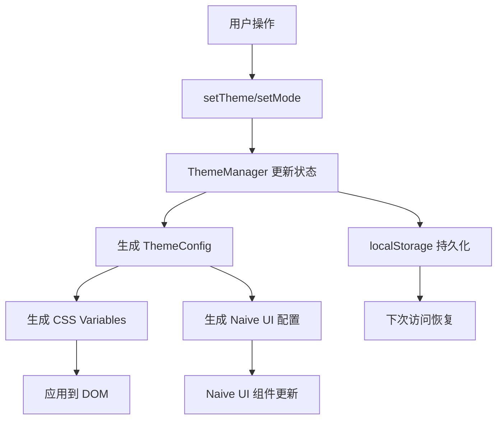

# @lee/theme

Vue 3 主题系统包，提供完整的主题管理、CSS 变量生成、Naive UI 集成等功能。

## 📋 目录

- [设计理念](#设计理念)
- [核心功能](#核心功能)
- [支持的主题](#支持的主题)
- [Naive UI 支持](#naive-ui-支持)
- [数据流](#数据流)
- [快速开始](#快速开始)
- [API 参考](#api-参考)
- [最佳实践](#最佳实践)

## 核心特性

- 🎨 **12套专业主题** - 基于 Ant Design 色板，覆盖各种应用场景
- 🌓 **明暗模式切换** - 每个主题都支持 light/dark 两种模式
- 🚀 **响应式更新** - 主题切换立即生效，无需刷新页面
- 💾 **自动持久化** - 主题配置自动保存到 localStorage
- 🎯 **TypeScript 支持** - 完整的类型定义和智能提示
- 🧩 **Naive UI 深度集成** - 完美适配所有 Naive UI 组件
- 🎨 **CSS 变量系统** - 基于 CSS Custom Properties，性能优异
- 📦 **单例模式** - 全局唯一的主题管理器，避免状态混乱
- 🔧 **框架无关核心** - 核心功能可独立使用，不依赖 Vue
- 🎭 **设计 Token** - 完整的设计系统支持（间距、圆角、阴影等）

## 设计理念

### 1. 响应式优先

主题系统基于 Vue 3 的响应式系统构建，所有主题状态都是响应式的，确保主题切换能立即生效，无需刷新页面。

### 2. CSS 变量驱动

通过 CSS 自定义属性（CSS Variables）实现主题系统，提供良好的性能和灵活性：

- 所有颜色值通过 `--le-*` 前缀的 CSS 变量注入
- 支持运行时动态切换
- 自动处理浏览器兼容性

### 3. 类型安全

完整的 TypeScript 类型定义，提供良好的开发体验：

- 主题配置类型约束
- API 参数类型提示
- 自动补全支持

### 4. 框架无关的核心

核心功能与 Vue 解耦，可独立使用，同时提供 Vue 专属的 Composable API。

## 项目结构

```
src/
├── types/              # 类型定义
│   ├── theme.ts       # 主题系统核心类型
│   └── presets.ts     # 色板相关类型
├── core/               # 核心功能
│   ├── theme-manager.ts   # 主题管理器（单例）
│   └── css-generator.ts   # CSS 变量生成器
├── themes/             # 主题配置
│   └── presets.ts     # 12套预设主题
├── presets/            # Ant Design 色板
│   └── index.ts       # 颜色定义（10级色阶）
├── tokens/             # 设计 Token
│   └── design.ts      # 间距、圆角、字体等
├── adapters/           # 框架适配器
│   └── naive.ts       # Naive UI 主题适配
├── composables/        # Vue Composable
│   └── useTheme.ts    # 响应式主题 Hook
└── index.ts           # 包入口，导出所有 API
```

## 核心功能

### ThemeManager（主题管理器）

单例模式的主题管理器，负责主题状态管理和 CSS 变量应用。

```typescript
import { themeManager } from '@lee/theme';

// 设置主题
themeManager.setTheme('blue');

// 设置模式
themeManager.setMode('dark');

// 获取当前配置
const theme = themeManager.getTheme();
const mode = themeManager.getMode();
```

### useTheme（组合式 API）

Vue 3 专属的响应式主题 Hook：

```typescript
import { useTheme } from '@lee/theme';

const { theme, mode, config, setTheme, setMode, toggleMode } = useTheme();

// theme、mode、config 都是响应式引用
watchEffect(() => {
  console.log('当前主题:', theme.value);
  console.log('当前模式:', mode.value);
});
```

### CSS 变量生成器

自动生成并应用 CSS 变量：

```typescript
// 生成的 CSS 变量示例
--le-primary: #1677FF;
--le-primary-hover: #4096FF;
--le-primary-active: #0958D9;
--le-text-1: rgba(0, 0, 0, 0.88);
--le-neutral-body: #fafafa;
// ... 更多变量
```

## 支持的主题

### 预设主题（12套）

基于 Ant Design 色板的专业配色方案：

| 主题   | 标识       | 中文名 | 主色    |
| ------ | ---------- | ------ | ------- |
| 蓝色   | `blue`     | 蓝色   | #1677FF |
| 红色   | `red`      | 红色   | #F5222D |
| 橙色   | `orange`   | 橙色   | #FA8C16 |
| 绿色   | `green`    | 绿色   | #52C41A |
| 紫色   | `purple`   | 紫色   | #722ED1 |
| 品红   | `magenta`  | 品红   | #EB2F96 |
| 青色   | `cyan`     | 青色   | #13C2C2 |
| 极客蓝 | `geekblue` | 极客蓝 | #2F54EB |
| 火山橙 | `volcano`  | 火山橙 | #FA541C |
| 金色   | `gold`     | 金色   | #FAAD14 |
| 黄色   | `yellow`   | 黄色   | #FADB14 |
| 青柠   | `lime`     | 青柠   | #A0D911 |

### 明暗模式

每个主题都支持浅色（light）和深色（dark）两种模式，自动适配不同场景。

## Naive UI 支持

### 主题适配器

提供专门的 Naive UI 主题适配器，自动生成符合 Naive UI 规范的主题配置：

```vue
<template>
  <n-config-provider :theme="naiveTheme" :theme-overrides="themeOverrides">
    <n-button type="primary">按钮</n-button>
  </n-config-provider>
</template>

<script setup lang="ts">
import { computed } from 'vue';
import { darkTheme } from 'naive-ui';
import { useTheme, createNaiveLightTheme, createNaiveDarkTheme } from '@lee/theme';

const { config, mode } = useTheme();

// 基础主题：浅色用 null，深色用 darkTheme
const naiveTheme = computed(() => {
  return mode.value === 'dark' ? darkTheme : null;
});

// 主题覆盖配置
const themeOverrides = computed(() => {
  return mode.value === 'dark'
    ? createNaiveDarkTheme(config.value)
    : createNaiveLightTheme(config.value);
});
</script>
```

### 组件主题定制

支持细粒度的组件样式定制，包括 Button、Card、Table、Menu 等所有 Naive UI 组件。

## 数据流



### 关键流程说明

1. **状态更新**：用户通过 `setTheme` 或 `setMode` 触发主题变更
2. **配置生成**：根据当前主题和模式生成完整的颜色系统配置
3. **CSS 变量注入**：将颜色配置转换为 CSS 变量并注入到根元素
4. **框架适配**：同时生成 Naive UI 所需的主题覆盖配置
5. **持久化存储**：自动保存到 localStorage，键名：`vue-monorepo-theme-config`

## 快速开始

### 安装

```bash
# 在 monorepo 根目录
pnpm install
```

### 基础使用

```vue
<template>
  <div class="container">
    <h1>主题演示</h1>
    <button @click="toggleMode">切换明暗</button>
  </div>
</template>

<script setup lang="ts">
import { useTheme } from '@lee/theme';

const { setTheme, toggleMode } = useTheme();

// 初始化主题
onMounted(() => {
  const savedTheme = localStorage.getItem('app-theme') || 'blue';
  const savedMode = localStorage.getItem('app-mode') || 'light';

  setTheme(savedTheme as any);
  setMode(savedMode as any);
});
</script>

<style>
.container {
  /* 使用主题变量 */
  background: var(--le-neutral-body);
  color: var(--le-text-1);
}

h1 {
  color: var(--le-primary);
}
</style>
```

### 高级用法

#### 1. 主题切换器组件

```vue
<script setup lang="ts">
import { useTheme, themePresets } from '@lee/theme';

const { theme, setTheme } = useTheme();

const themeOptions = computed(() => {
  return Object.values(themePresets).map(preset => ({
    name: preset.name,
    label: preset.label,
    color: preset.primaryColor,
  }));
});
</script>

<template>
  <div class="theme-picker">
    <div
      v-for="option in themeOptions"
      :key="option.name"
      :class="{ active: theme === option.name }"
      @click="setTheme(option.name)"
    >
      <span class="color-dot" :style="{ background: option.color }" />
      <span>{{ option.label }}</span>
    </div>
  </div>
</template>
```

#### 2. 响应式主题监听

```typescript
import { useTheme } from '@lee/theme';

const { config, mode } = useTheme();

// 监听主题配置变化
watchEffect(() => {
  console.log('主题配置更新:', config.value);
});

// 监听模式变化
watch(mode, newMode => {
  console.log('模式切换到:', newMode);
});
```

## API 参考

### useTheme

```typescript
interface UseThemeReturn {
  // 响应式状态
  theme: ComputedRef<ThemeName>;
  mode: ComputedRef<ThemeMode>;
  config: ComputedRef<ThemeConfig>;
  cssVars: ComputedRef<CssVariables>;

  // 操作方法
  setTheme: (theme: ThemeName) => void;
  setMode: (mode: ThemeMode) => void;
  toggleMode: () => void;
  initTheme: (options?: ThemeSwitchOptions) => void;

  // 工具方法
  getCssVar: (name: string) => string;
  getAllCssVars: () => Record<string, string>;
}
```

### ThemeManager

```typescript
class ThemeManager {
  // 获取单例
  static getInstance(): ThemeManager;

  // 主题操作
  setTheme(theme: ThemeName): void;
  setMode(mode: ThemeMode): void;
  toggleMode(): void;

  // 状态获取
  getTheme(): ThemeName;
  getMode(): ThemeMode;
  getConfig(): ThemeConfig;

  // CSS 变量
  getCssVar(name: string): string;
  getAllCssVars(): Record<string, string>;
}
```

### Naive UI 适配器

```typescript
// 创建浅色主题覆盖
function createNaiveLightTheme(config: ThemeConfig): GlobalThemeOverrides;

// 创建深色主题覆盖
function createNaiveDarkTheme(config: ThemeConfig): GlobalThemeOverrides;

// 通用主题创建（自动判断模式）
function createNaiveTheme(config: ThemeConfig): GlobalThemeOverrides;
```

### 类型导出

```typescript
// 主题相关类型
export type ThemeName =
  | 'blue'
  | 'red'
  | 'orange'
  | 'green'
  | 'purple'
  | 'magenta'
  | 'cyan'
  | 'geekblue'
  | 'volcano'
  | 'gold'
  | 'yellow'
  | 'lime';
export type ThemeMode = 'light' | 'dark';

// 配置相关接口
export interface ThemeConfig {
  name: ThemeName;
  mode: ThemeMode;
  colors: ColorSystem;
  tokens: DesignTokens;
}

export interface ThemePreset {
  name: ThemeName;
  label: string;
  primaryColor: string;
  light: Partial<ColorSystem>;
  dark: Partial<ColorSystem>;
}

// 工具类型
export interface ThemeManagerOptions {
  defaultTheme?: ThemeName;
  defaultMode?: ThemeMode;
  prefix?: string;
  storageKey?: string;
}
```

## 最佳实践

### 1. 在应用根组件初始化

```vue
<!-- App.vue -->
<script setup lang="ts">
import { onMounted } from 'vue';
import { useTheme } from '@lee/theme';

const { initTheme } = useTheme();

onMounted(() => {
  // 从 localStorage 恢复主题
  const savedTheme = localStorage.getItem('app-theme');
  const savedMode = localStorage.getItem('app-mode');

  initTheme({
    theme: savedTheme || 'blue',
    mode: savedMode || 'light',
  });
});
</script>
```

### 2. 使用 CSS 变量而非硬编码

```css
/* ❌ 避免硬编码 */
.button {
  background: #1677ff;
  color: #ffffff;
}

/* ✅ 使用主题变量 */
.button {
  background: var(--le-primary);
  color: var(--le-text-invert);
}
```

### 3. 响应式引用的正确使用

```typescript
const { theme, mode } = useTheme();

// ✅ 在 setup 中访问值
console.log(theme.value);  // 需要 .value

// ✅ 在模板中自动解包
<div>{{ theme }}</div>  // 不需要 .value
```

### 4. 组件库集成模式

对于 Naive UI 项目，推荐在 App.vue 统一配置：

```vue
<template>
  <n-config-provider :theme="naiveTheme" :theme-overrides="themeOverrides">
    <n-message-provider>
      <n-dialog-provider>
        <router-view />
      </n-dialog-provider>
    </n-message-provider>
  </n-config-provider>
</template>
```

## 设计 Token

除了颜色系统，主题包还提供完整的设计 Token：

- **间距**：`spacing-xs` 到 `spacing-xxl`
- **圆角**：`radius-xs` 到 `radius-xl`
- **字体**：`font-size-xs` 到 `font-size-xxl`
- **阴影**：`shadow-1` 到 `shadow-3`
- **动画**：`duration-fast` 到 `duration-slow`

## CSS 变量说明

所有 CSS 变量都带有 `--le-` 前缀，避免与其他库冲突。

### 主题色变量

```css
--le-primary           /* 主色 */
--le-primary-hover     /* 主色悬停 */
--le-primary-active    /* 主色激活 */
--le-primary-suppl     /* 主色补充 */
```

### 功能色变量

```css
--le-info              /* 信息色 */
--le-success           /* 成功色 */
--le-warning           /* 警告色 */
--le-error             /* 错误色 */
```

### 中性色变量

```css
--le-text-1            /* 一级文本 */
--le-text-2            /* 二级文本 */
--le-text-3            /* 三级文本 */
--le-text-disabled     /* 禁用文本 */

--le-neutral-body      /* 页面背景 */
--le-neutral-card      /* 卡片背景 */
--le-neutral-modal     /* 弹窗背景 */
--le-neutral-popover   /* 气泡背景 */
```

### 其他常用变量

```css
--le-border            /* 边框色 */
--le-divider           /* 分割线 */
--le-hover             /* 悬停背景 */
--le-pressed           /* 按下背景 */
--le-shadow-1          /* 阴影级别1 */
--le-shadow-2          /* 阴影级别2 */
--le-shadow-3          /* 阴影级别3 */
```

### 设计 Token 变量

```css
/* 间距 */
--le-spacing-xs: 4px --le-spacing-sm: 8px --le-spacing-md: 12px --le-spacing-lg: 16px
  --le-spacing-xl: 24px --le-spacing-xxl: 32px /* 圆角 */ --le-radius-xs: 2px --le-radius-sm: 4px
  --le-radius-md: 6px --le-radius-lg: 8px --le-radius-xl: 12px /* 字体大小 */
  --le-font-size-xs: 12px --le-font-size-sm: 14px --le-font-size-md: 16px --le-font-size-lg: 18px
  --le-font-size-xl: 20px --le-font-size-xxl: 24px;
```

## 贡献指南

欢迎提交 Issue 和 Pull Request！

## License

MIT
