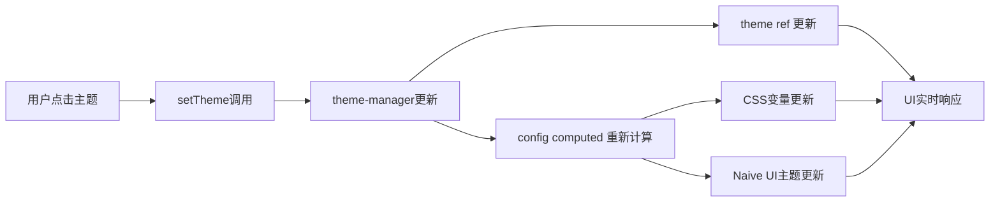

# 主题响应式更新修复

## 问题描述

之前在 ThemeSetting 组件中改变主题色后，需要刷新浏览器才能看到效果。

## 问题原因

`useTheme` composable 返回的状态值失去了响应性。原因是返回了 `.value` 而不是响应式引用本身：

```typescript
// ❌ 错误：返回静态值
return {
  theme: theme.value, // 这会返回当前值，不是响应式的
  mode: mode.value,
  config: config.value,
  cssVars: cssVars.value,
  // ...
};
```

## 解决方案

### 1. 修复 useTheme 返回值

```typescript
// ✅ 正确：返回响应式引用
return {
  theme, // ComputedRef<ThemeName>
  mode, // ComputedRef<ThemeMode>
  config, // ComputedRef<ThemeConfig>
  cssVars, // ComputedRef<CssVariables>
  // ...
};
```

### 2. 更新类型定义

```typescript
export interface UseThemeReturn {
  // 状态现在是响应式引用
  theme: ComputedRef<ThemeName>;
  mode: ComputedRef<ThemeMode>;
  config: ComputedRef<ThemeConfig>;
  cssVars: ComputedRef<CssVariables>;
  // ...
}
```

### 3. 使用方式调整

在 **script** 中访问值需要 `.value`：

```typescript
const { theme, mode, config } = useTheme();

// script 中需要 .value
console.log(theme.value); // 'blue'
console.log(mode.value); // 'light' | 'dark'

// computed 中也需要 .value
const isDark = computed(() => mode.value === 'dark');
```

在 **template** 中自动解包，不需要 `.value`：

```vue
<template>
  <!-- 模板中自动解包 -->
  <div>当前主题：{{ theme }}</div>
  <div v-if="mode === 'dark'">深色模式</div>
</template>
```

## 验证方法

1. 打开应用
2. 点击主题设置按钮
3. 切换不同的主题色
4. **应该立即看到颜色变化**，无需刷新
5. 切换明暗模式
6. **应该立即看到背景和文字颜色变化**

## 工作原理



## 受影响的组件

- ✅ **ThemeSetting.vue** - 已修复
- ✅ **App.vue** - 已修复
- 任何使用 `useTheme` 的组件都需要确保正确处理响应式引用

## 总结

通过保持响应式引用的完整性，主题切换现在可以立即生效，提供了更好的用户体验。
